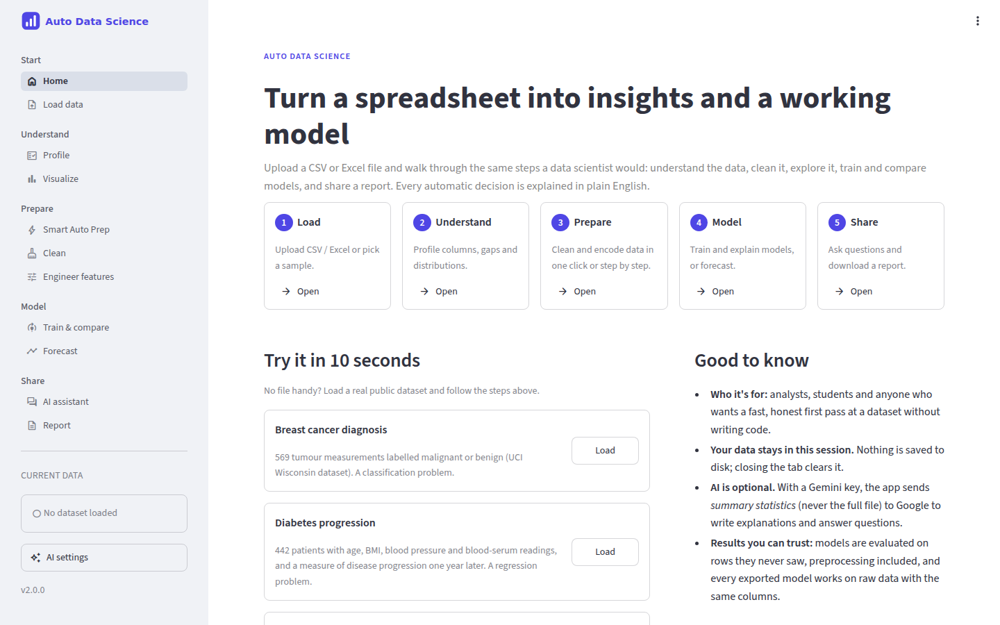
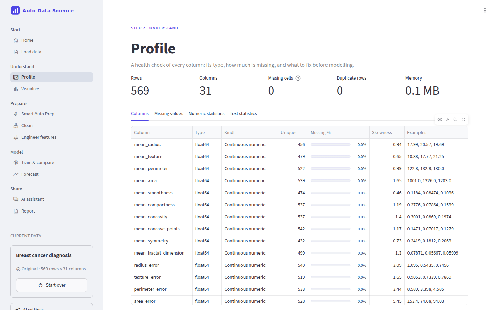
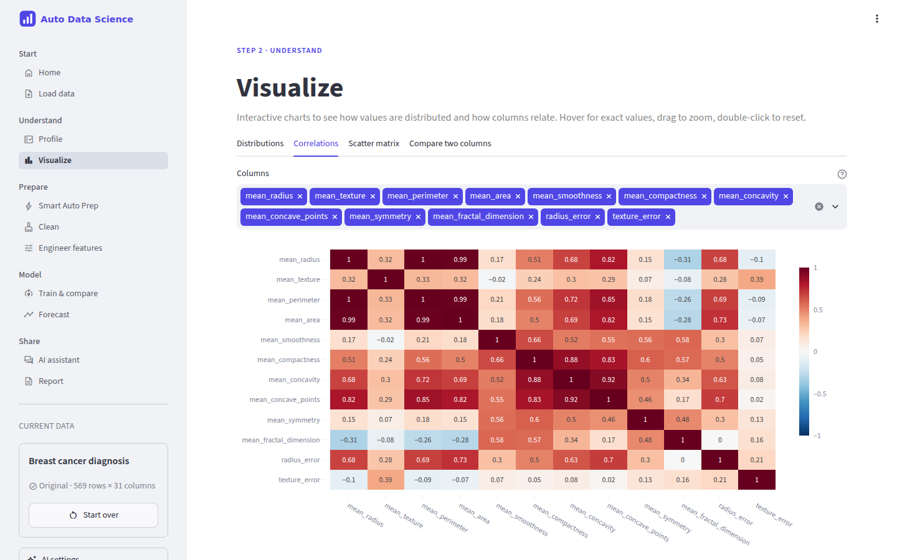
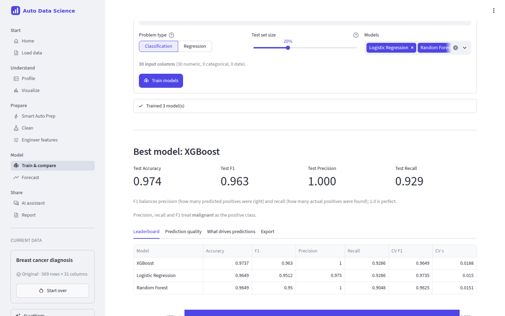
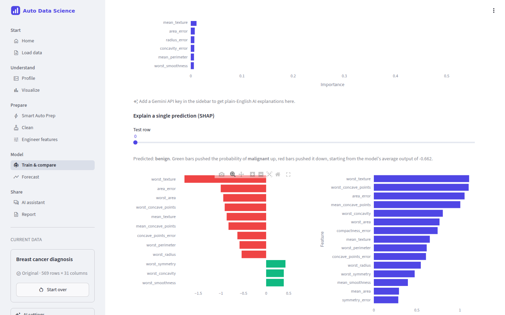
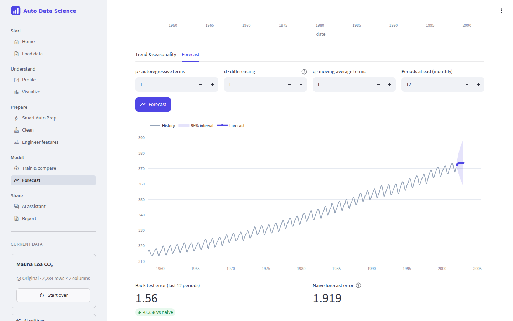
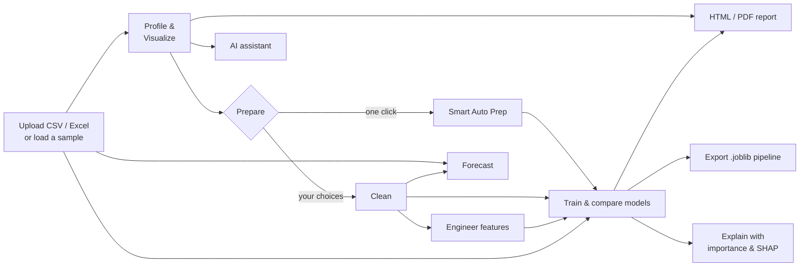
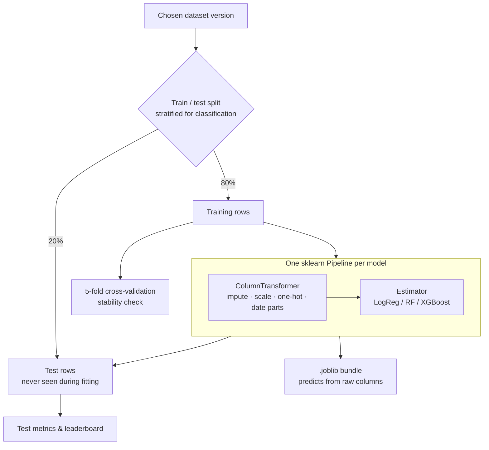
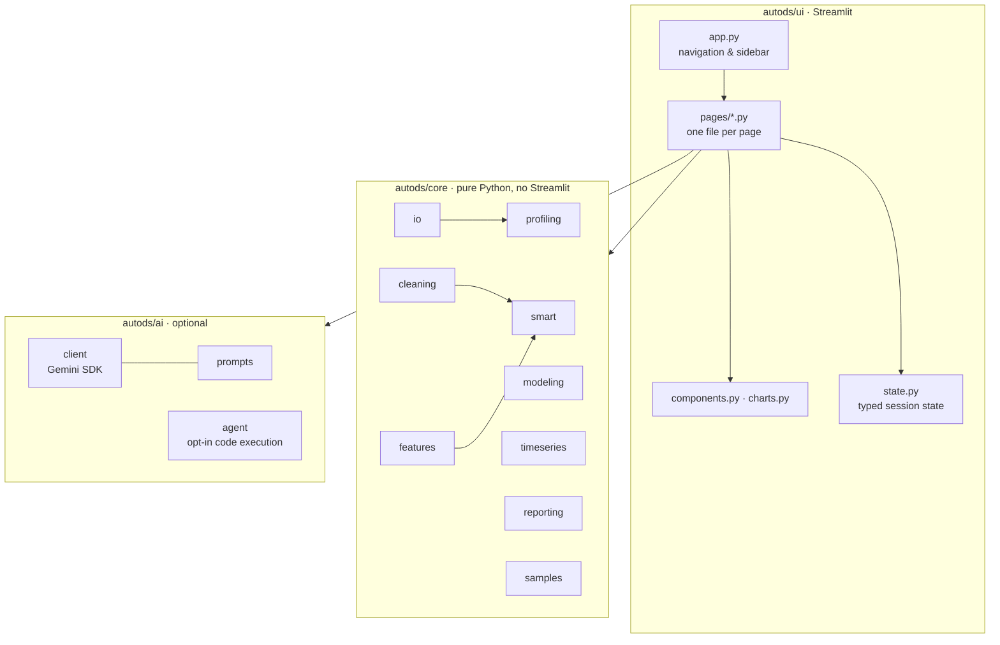

<div align="center">


**Upload a spreadsheet. Understand it, clean it, model it and explain it, without writing code.**

[](https://github.com/sakshamg251206/DataRobot/actions/workflows/ci.yml)




</div>

---

## What is this?

**Auto Data Science** is a web app that walks you through a complete data science project in
your browser. You upload a table (CSV or Excel), and the app helps you:

1. **Understand** what's in it: column types, missing values, odd distributions.
2. **Prepare** it: fix numbers stored as text, parse dates, remove duplicates, fill gaps, handle outliers.
3. **Explore** it with interactive charts.
4. **Predict** something: train several machine-learning models, compare them fairly and see *why* they predict what they do.
5. **Forecast** a number over time.
6. **Share** the results as an HTML or PDF report, or ask questions in plain English (optional AI).

Every automatic decision is written down in a plain-English log ("Filled gaps in skewed columns with
the median: income"), so you always know what happened to your data.

### The problem it solves

The first few hours with any new dataset look the same: load it, find out why the numbers are text,
work out which columns are junk, fill gaps, try a few models, and discover that the impressive score
came from a mistake. Spreadsheets can't do most of this, and notebooks need coding skills and
discipline to avoid subtle errors.

This app packages those first hours into a guided, repeatable flow with sensible, *explained* defaults.
It is for:

- **Analysts and domain experts** who want a quick, trustworthy first look at a dataset and a
  baseline model without writing code.
- **Students** learning the data science workflow, with each step labelled and explained.
- **Data scientists** who want a fast baseline and a shareable report before doing bespoke work.

### Why it exists

It started as a personal project to automate the repetitive parts of exploratory data analysis. Version 2
is a ground-up rework focused on **correctness** (honest model evaluation, no data leakage),
**clarity** (a UI that explains itself) and **engineering quality** (tested, typed, documented, deployable).

## Screenshots

| Profile every column | Interactive visualisations |
| --- | --- |
|  |  |
| **Compare models on held-out data** | **Explain individual predictions (SHAP)** |
|  |  |

<p align="center"><br>
<em>Forecasting the Mauna Loa CO₂ sample, with a back-test against a naive baseline.</em></p>

All screenshots are of the app running on its built-in sample datasets.

## Features

| Area | What you get |
| --- | --- |
| **Load** | CSV, TSV and Excel files. Delimiters (`,` `;` tab `\|`) and text encodings are detected automatically, and messy column names are tidied. Three real sample datasets are included so you can try everything immediately. |
| **Profile** | Column-by-column health check: inferred *kind* (identifier, date, category, free text, numeric…), missing values with severity, skewness, summary statistics and a "needs attention before modelling" list. |
| **Visualize** | Distributions, correlation heatmap with the strongest pairs, scatter matrix, and a "compare two columns" view that picks the right chart (scatter, box plot or heatmap) for the column types. |
| **Smart Auto Prep** | One click to a fully numeric, model-ready table. Type fixes, de-duplication, removal of ID and free-text columns, skew-aware gap filling, outlier capping, date features, encoding and removal of redundant columns, plus a before/after *ML readiness score*. |
| **Clean** | The same building blocks with your choices: median / mean / KNN / forward-fill imputation, IQR or Z-score outlier detection, cap or remove. |
| **Engineer features** | One-hot or ordinal encoding, standard or min-max scaling, ratio and polynomial features. Download the result as CSV. |
| **Train & compare** | Logistic/Linear Regression, Random Forest and XGBoost on a held-out test set, with cross-validation, a confusion matrix or actual-vs-predicted plot, learning curves, feature importance and per-prediction SHAP explanations. |
| **Export a model** | Download the *entire* pipeline (gap filling, encoding, scaling and model) as a `.joblib` bundle that predicts directly from raw data with the same columns. |
| **Forecast** | Resample any metric by day, week, month, quarter or year; trend/seasonality decomposition; stationarity (ADF) test; ARIMA forecast with a 95% interval and a back-test against a naive baseline. |
| **AI assistant** *(optional)* | Plain-English explanations of charts and models, and a chat about your dataset, powered by Google Gemini. |
| **Report** | Self-contained interactive HTML report or compact PDF with overview, processing steps, missing values, charts and model scores. |

## How it works



The app keeps **versions** of your data side by side (*Original*, *Cleaned*, *Smart prep*,
*Engineered*). Each page lets you pick which version to work on, so you can compare approaches and
never lose the original.

### How models are evaluated fairly

The most common mistake in quick ML work is letting information from the test rows leak into
training, for example by filling gaps with an average computed over *all* rows before splitting.
The result looks great and then fails in real use. Here, every model is a single scikit-learn
pipeline, and the split happens **before** anything is learned:



On top of that, the app:

- Excludes identifier, free-text and constant columns automatically, and says why.
- Excludes engineered columns built from the target (e.g. `price_squared` when predicting `price`)
  and warns when a feature is almost perfectly correlated with the target.
- Protects the target everywhere: it is never imputed, capped, encoded or used to build features.
  Rows without a target value are dropped.

## Architecture



- **`autods/core`** holds all data logic as plain functions that take and return pandas or
  scikit-learn objects plus a human-readable log. It never imports Streamlit, so it is unit tested
  directly and could back a CLI or API unchanged.
- **`autods/ui`** is a thin presentation layer. Pages read and write session data only through
  `state.py`, and shared look-and-feel lives in `components.py` and `charts.py`.
- **`autods/ai`** wraps Google's `google-genai` SDK. Prompts are pure, tested functions. The app
  works fully without it.

## Tech stack

| Layer | Choice | Why |
| --- | --- | --- |
| UI | [Streamlit](https://streamlit.io) (multipage `st.navigation`) | Interactive data apps in pure Python; fits a single-user analysis tool. |
| Data | pandas, NumPy | The standard for tabular data; works with both pandas 2 and 3. |
| ML | scikit-learn, XGBoost, SHAP | Pipelines make leakage-free evaluation the default; SHAP for explanations. |
| Time series | statsmodels | ADF test, seasonal decomposition and ARIMA. |
| Charts | Plotly | Interactive and theme-aware; the same figures embed in the HTML report. |
| Reports | fpdf2 + standalone HTML | No headless browser or system libraries needed. |
| AI | Google Gemini via `google-genai` | Optional explanations and chat. |
| Quality | pytest, ruff, mypy, GitHub Actions | Tests, lint, format and type checks on every push. |

## Project structure

```text
.
├── app.py                    # Streamlit entry point
├── autods/
│   ├── config.py             # Settings from environment variables
│   ├── core/                 # Framework-free logic (fully unit tested)
│   │   ├── dtypes.py         #   column-type helpers (pandas 2 & 3)
│   │   ├── io.py             #   reading files, tidying names, quality warnings
│   │   ├── profiling.py      #   column kinds, missing values, statistics
│   │   ├── cleaning.py       #   cleaning steps + clean_dataset()
│   │   ├── features.py       #   encoding, scaling, ratio & polynomial features
│   │   ├── smart.py          #   one-click Smart Auto Prep + readiness score
│   │   ├── modeling.py       #   pipelines, training, metrics, SHAP, export
│   │   ├── timeseries.py     #   resampling, decomposition, ADF, ARIMA
│   │   ├── reporting.py      #   HTML and PDF reports
│   │   └── samples.py        #   built-in sample datasets
│   ├── ai/                   # Optional Gemini integration
│   │   ├── client.py         #   SDK wrapper with friendly errors
│   │   ├── prompts.py        #   prompt builders (pure functions)
│   │   └── agent.py          #   opt-in code-executing agent
│   └── ui/                   # Streamlit presentation layer
│       ├── app.py            #   page config, navigation, sidebar
│       ├── state.py          #   typed session-state access
│       ├── components.py     #   shared widgets and layout helpers
│       ├── charts.py         #   Plotly figure builders
│       └── pages/            #   one script per page
├── tests/                    # pytest suite (core logic + headless UI smoke tests)
├── assets/                   # logo and favicon
├── docs/screenshots/         # README images
├── .streamlit/config.toml    # theme and server settings
├── .github/workflows/ci.yml  # lint, type-check, test, Docker build
├── Dockerfile
├── Makefile
├── pyproject.toml            # dependencies and tool configuration
├── requirements.txt          # deploy-time install (points at pyproject)
└── .env.example              # documented environment variables
```

## Getting started

### Prerequisites

- Python **3.10, 3.11 or 3.12**
- Optional: a free [Gemini API key](https://aistudio.google.com/apikey) for the AI features

### Install

```bash
git clone https://github.com/sakshamg251206/DataRobot.git
cd DataRobot
python -m venv .venv
source .venv/bin/activate        # Windows: .venv\Scripts\activate
pip install -e ".[ml,dev]"       # or: make install
```

`ml` adds XGBoost and SHAP, and `dev` adds the test and lint tools. For a runtime-only install,
`pip install -r requirements.txt` is enough.

### Run

```bash
streamlit run app.py             # or: make run
```

Open <http://localhost:8501>, click **Load** next to a sample dataset on the home page, and follow
the steps in the sidebar.

### Environment variables

All optional. Copy `.env.example` to `.env` (loaded automatically) or set them in your environment.

| Variable | Default | Purpose |
| --- | --- | --- |
| `GOOGLE_API_KEY` | *(empty)* | Server-side Gemini key. If empty, each user can paste their own key in the sidebar (kept only in their browser session). |
| `GEMINI_MODEL` | `gemini-2.5-flash` | Gemini model for explanations and chat. |
| `ENABLE_CODE_AGENT` | `false` | Lets the assistant **write and execute Python** on the data. Needs `pip install -e ".[agent]"`. Local, single-user use only. |
| `AUTODS_MAX_ROWS` | `1000000` | Uploaded files longer than this are truncated. |
| `AUTODS_RANDOM_STATE` | `42` | Seed for splits and models, for reproducible results. |

Streamlit's own settings (theme, 200 MB upload limit) are in `.streamlit/config.toml`.

## Testing and quality checks

```bash
make check        # everything CI runs: lint + type-check + tests
make test         # pytest
make coverage     # tests with a coverage report for autods/core and autods/ai
make lint         # ruff lint + format check
make typecheck    # mypy
```

The suite has two layers:

- **Unit tests** for all core logic: file reading edge cases (encodings, delimiters, Excel),
  cleaning rules, encoding, leakage-free pipelines (e.g. the scaler sees only training rows),
  unseen categories at prediction time, model export round-trip, SHAP shapes, time-series
  aggregation, HTML escaping in reports and AI prompts with a mocked client.
- **Headless UI smoke tests** using Streamlit's `AppTest`, which render every page with no data and
  with two sample datasets, and run the clean → prepare → train → report and forecast flows end to end.

CI runs on Python 3.10 and 3.12 for every push and pull request, and also checks that the Docker
image builds.

## Deployment

**Streamlit Community Cloud** (free, simplest)

1. Fork or push this repo to GitHub.
2. At [share.streamlit.io](https://share.streamlit.io), create an app with main file `app.py`.
   `requirements.txt` is picked up automatically.
3. Optional: under *Secrets*, add `GOOGLE_API_KEY = "…"` to give every visitor AI features on your
   quota. Otherwise users paste their own key.

**Docker** (any container host: Cloud Run, Fly.io, Render, a VM…)

```bash
docker build -t autods .
docker run -p 8501:8501 -e GOOGLE_API_KEY=your-key autods   # key optional
```

The image runs as a non-root user and exposes a health check at `/_stcore/health`.

> **Public deployments:** leave `ENABLE_CODE_AGENT` off. Each visitor's data lives in their own
> server-side session memory and is discarded when the session ends.

## Important technical decisions

- **Core logic separated from the UI.** The original version mixed `st.*` calls into the data
  functions, which made them impossible to test. Now `autods/core` is pure and the UI is a thin layer.
- **scikit-learn pipelines for all modelling.** Preprocessing is learned on training rows only, and
  the exported file contains the preprocessing too, so it works on raw data. Version 1 encoded test
  data with separately fitted encoders, which misaligned columns.
- **Dataset versions instead of overwriting.** Users can compare the original with the cleaned or
  engineered data, and model results are invalidated automatically when their source data changes.
- **Plain-English logs everywhere.** Automation is only trustworthy if it is inspectable. Every step
  reports what it changed and why, and the log flows into the report.
- **AI is optional and conservative.** Only summary statistics and a few sample rows are sent to
  the model. The API key is held per browser session; version 1 wrote it to a process-wide
  environment variable, which leaked one user's key to every other user on a shared server. The
  code-executing agent (LLM-written Python run on the server) is off by default.
- **Official Google SDK instead of LangChain** for plain text generation: fewer dependencies and
  fewer breaking changes. LangChain remains only in the opt-in agent extra.
- **pandas 2 *and* 3 support.** Text columns are detected by dtype family, not `object`, because
  pandas 3 stores strings in a dedicated dtype.

## Limitations and future improvements

- **In-memory, single-session design.** Data lives in the Streamlit session and is lost on refresh.
  Very large files (millions of rows) are slow; charts are sampled to 5,000 points. Persisted projects
  and out-of-core processing (e.g. Polars or DuckDB) would be the next step for bigger data.
- **Model search is deliberately simple:** three model families with sensible defaults and no
  hyperparameter tuning. Adding tuning (e.g. randomized search) and more models (LightGBM, CatBoost)
  would raise accuracy at the cost of speed.
- **Smart Auto Prep and Engineer features fit statistics (medians, scalers) on the whole table**,
  which is fine for exploration and export. The Train page re-learns its own preprocessing on training
  rows, but if you train *on* an already-imputed version, those values were computed with the test
  rows included. Train on *Original* or *Cleaned* for the strictest evaluation.
- **Heuristics can misjudge columns**, for example a numeric code read as a number or an ID read as a
  category. The app shows what it decided so you can override it (for instance by choosing the
  problem type manually).
- **ARIMA orders are chosen manually** (with a suggested *d*). Automatic order selection and models
  with external regressors are possible extensions.
- **AI answers come from summaries**, so the default assistant can't compute exact row-level
  answers. The opt-in agent can, but it executes generated code and isn't suitable for shared servers.
- **No authentication.** Put it behind your platform's access controls if the data is sensitive.

## Contributing

Issues and pull requests are welcome. Please run `make check` before opening a PR. New data logic
belongs in `autods/core` with tests, and UI code in `autods/ui`.
